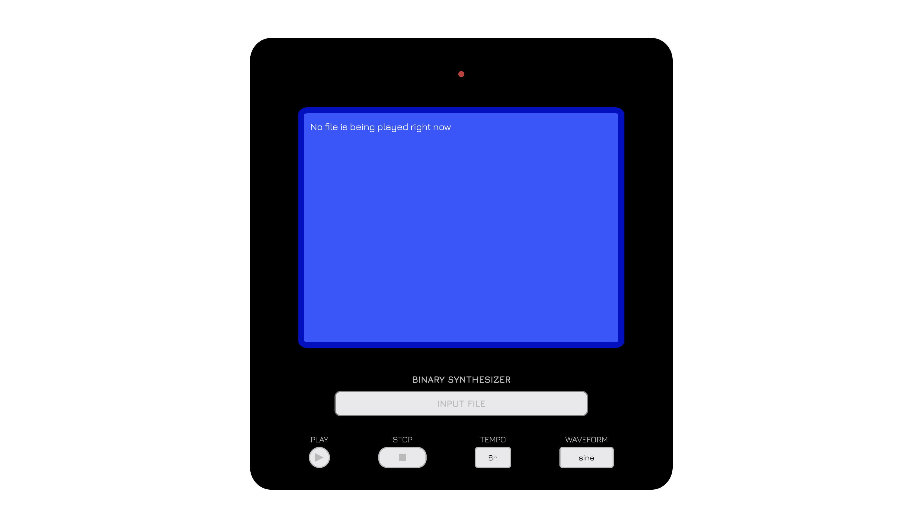
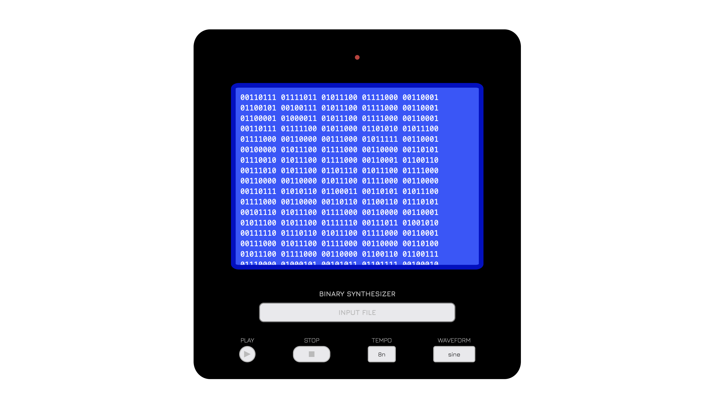

# Binary Synthesizer

## Project Overview
Our program takes in a text file, converts it from digital (binary) to analog (sound), and outputs the sound based on the binary patterns of the text file.

## Inspiration
* [Tristan Perich's 1-Bit Symphony](https://tristanperich.bandcamp.com/album/1-bit-symphony)
* [Bytebeats](https://greggman.com/downloads/examples/html5bytebeat/html5bytebeat.html)

## Installation and Usage
Download the code as a ZIP, then extract it and open the front.html file in a browser.

## UI Design

    Start Screen

    Binary code displayed on the screen after inputting a file

    After clicking on the play button

