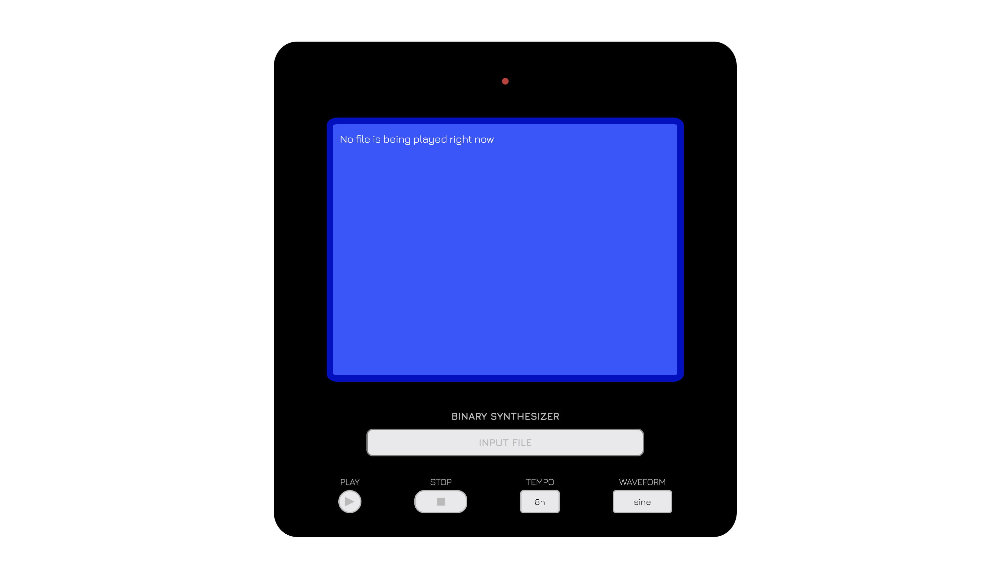
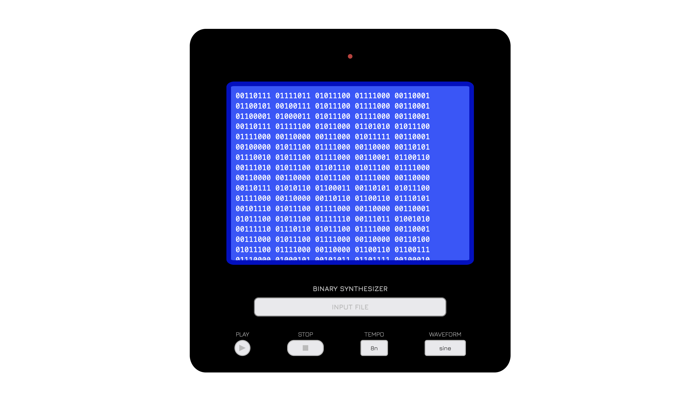

# Binary Synthesizer

## Our Project
Our program takes in a text file, converts it from digital (binary) to analog (sound), and outputs the sound based on the binary patterns of the text file.

## Inspiration
[Tristan Perich's 1-Bit Symphony](https://tristanperich.bandcamp.com/album/1-bit-symphony), 
[Bytebeats](https://greggman.com/downloads/examples/html5bytebeat/html5bytebeat.html)

## UI Design

